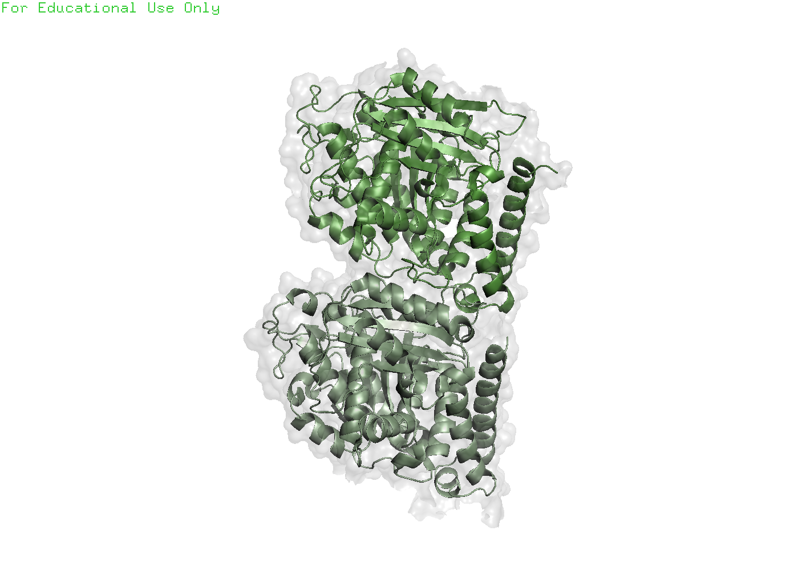

-> this file is still a work in progress <- 

### Visualizing proteins

1. Is representation of protein useful?
2. Should we know how proteins we work with are represented into the three dimensional space?
3. Are the information coming from structural biologists relevant for wet biologists?

First: Protein representations are cool. Second: no way to get a publication-quality figure without a program like Chimera or PyMol. That should be enough to motivate you in learning how to use them. 

A part from that, learning how to modeling proteins is necessary for structural analysis, molecular docking, molecular dynamic simulations, structural similarities and much more. 

My experience with protein modelling and with protein folding is unfortunate. Almost my entire career was based on the study of Intrinsically Disordered Proteins (IDP) like Tau and Synuclein. These proteins are also called misfolding proteins... Easy to get from their names, it's kind of hard to get their 3D structure (even for AlphaFold).

Tubulin is one of the first proteins I entered in contact with during my career. I thought it could be a good idea to show how to achieve a representation similar to this one. 

At the end of this post you can also find a script that can automatically take your PDB file and generate the high-quality image you may need. 

---
Useful links
- [PyMol Command Reference](https://pymol.org/pymol-command-ref.html)
- General [PyMol Wiki](https://pymolwiki.org/index.php/Main_Page)
- A good [youtube videos playlist](https://www.youtube.com/watch?v=UN8cj7omiCM&list=PLUMhYZpMLtanlp_zVde7CWsRr1EnCzAFD&index=1) on how to use pymol
- [PyMol tutorial](https://www.youtube.com/watch?v=o4XR-0VTXrY&t=2193s) ~ 1 hour 
- [Video tutorial](https://www.youtube.com/watch?v=fVOpB75Xzmo&t=2s) for preparing good quality images
